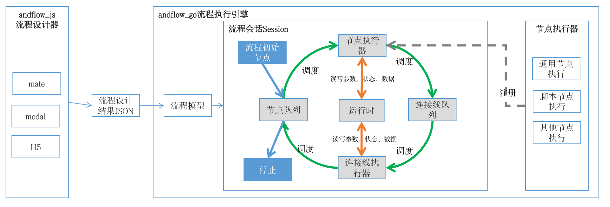

这个项目使用golang开发，用于执行andflow的流程设计结果json文件。



## 入门例子
```

import (
	"fmt"
	"io/ioutil"

	"github.com/zone-7/andflow_go/actions"
	"github.com/zone-7/andflow_go/engine"
)

func main() {
	file := "4执行脚本.json"

	engine.RegistActionRunner("common", &actions.CommonActionRunner{})

	param := make(map[string]interface{})

	data, _ := ioutil.ReadFile(file)

	flow, err := engine.ParseFlow(string(data))
	if err != nil {
		fmt.Println(err)
		return
	}

	runtime := engine.CreateRuntime(flow, param)

	runner := engine.CommonFlowRunner{}
	engine.Execute(runtime, &runner, 10000)

	fmt.Println("time used(ms):", runtime.Timeused)

}


```

## 执行步骤如下：
```
    //1. 注册一个通用的节点执行器
    engine.RegistActionRunner("common", &actions.CommonActionRunner{})
    //2. 设置参数
	param := make(map[string]interface{})
    //读取流程json文件 
	data, _ := ioutil.ReadFile(demo_path + "/5执行命令.json")
    //3. 解析json文件
	flow, err := engine.ParseFlow(string(data))
	if err != nil {
		fmt.Println(err)
	}
    //4. 创建一个运行时
	runtime := engine.CreateRuntime(flow, param)
    
	//5. 创建一个流程执行器
	runner := engine.CommonFlowRunner{}
    
    //6. 执行流程，超时时间是10000毫秒
	engine.Execute(runtime, &runner, 10000)
     
	  

```

